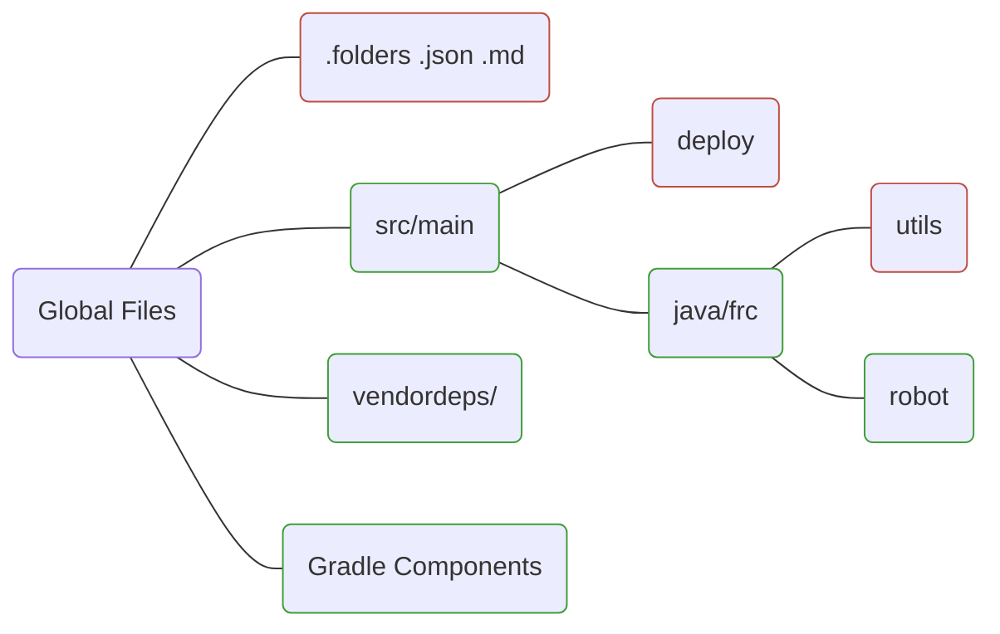

# Isometric ASCII Sandbox
```java
      ___
     |\__\          
     | |  |                               ___
     |\|__|__                  ___       |\__\
     | |  |__\                |\__\      | |  |        
     |\|__||  |               |\__\|__   |\|__|        
     | |  ||__|               | |  |__\_ | |  |
     |\|__||  |             __|\|__||\__\|\|__|
    |\__\ ||__|   ___      |\_| |  || |  | |  |
    | |  |||  |  |\__\____ | ||\|__||\|__|\|__|
    |\|__|||__|__|_|  |\__\|\|| |  || |  | |\__\        
    | |  |||\__|\__\__| |  |_||\|__||\|__||\__\ |       
    |\|__|_\ |\| |  | |\|__|_\| |  || |  || |  ||       
 ___| |  |  || |\|__||\__\_|  |\|__||\|__|\\|__|_\_     
|\__|\|__|__|||\__\ || |\__\__| |  || |  |__\| |\__\    
| | | |\__\ ||| |  |||\| |  |__\|__|_\|__|_\__\| |  |   
|\|_|\| |  ||||\|__||| |\|__||  |  |  |\__\ |  |\|__|   
| |\| |\|__||\| |  ||_\| |  ||__|__|__| |  ||__| |  |_  
 \| |\| |\__\ |\|__|_\__\|__||  |\__\ |\|__||\__\|__|_\ 
   \| |\| |  || |  |  |  |  ||__| |  || |  || |  |  |  |
     \| |\|__|_\|__|__|__|__||  |\|__||\|__||\|__|__|__|
       \| |  |  |  |  |  |  ||__| |  || |  || |  |  |  |
         \|__|__|__|__|__|__|    \|__| \|__| \|__|__|__|
```


> [!Warning]
> `blockrenderer.java` is outdated, available only for archive purposes. Utilize `Scene` and `Textures` for sandboxing.

## Installation
No installation required beyond JDK. Ensure you have Java installed.

## Usage
Create a scene by instantiating a `Scene` object. Specify width, heighth, and depth respectively:
```java
Scene template = new Scene(5,5,5);
```
Add a block to the scene using `.add_block()`, specifying coordinates:
```java
template.add_block(0,0,0);
```
Remove a block from the scene using `.remove_block()`, specifying coordinates:
```java
template.remove_block(0,0,0);
```
Update the projection:
```java
template.update_canvas();
```
Generate the canvas as a printable `String`:
```java
template.construct_canvas()
```

## License
This project is licensed under the MIT License.



